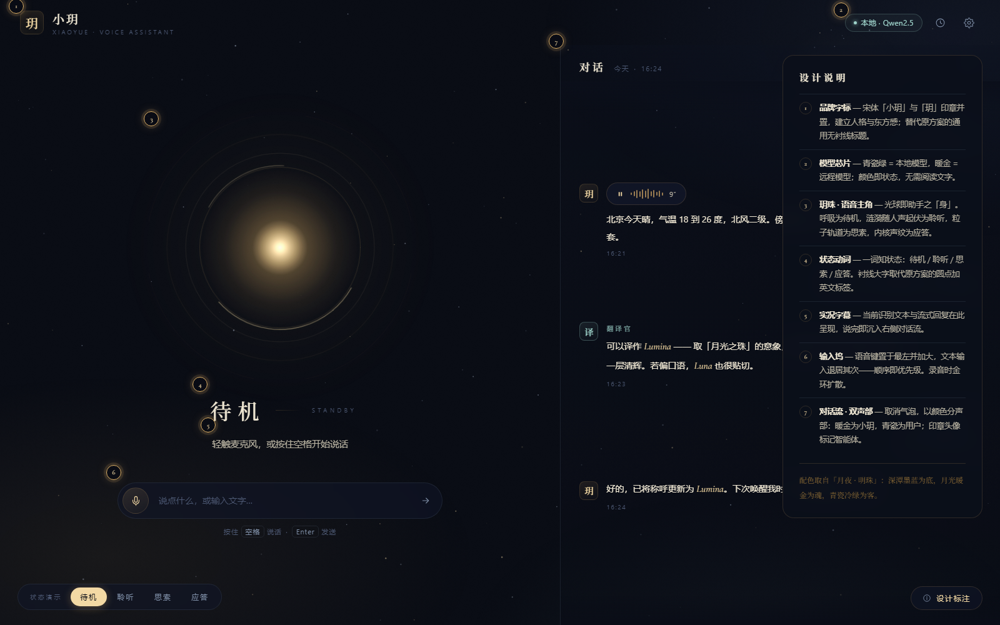
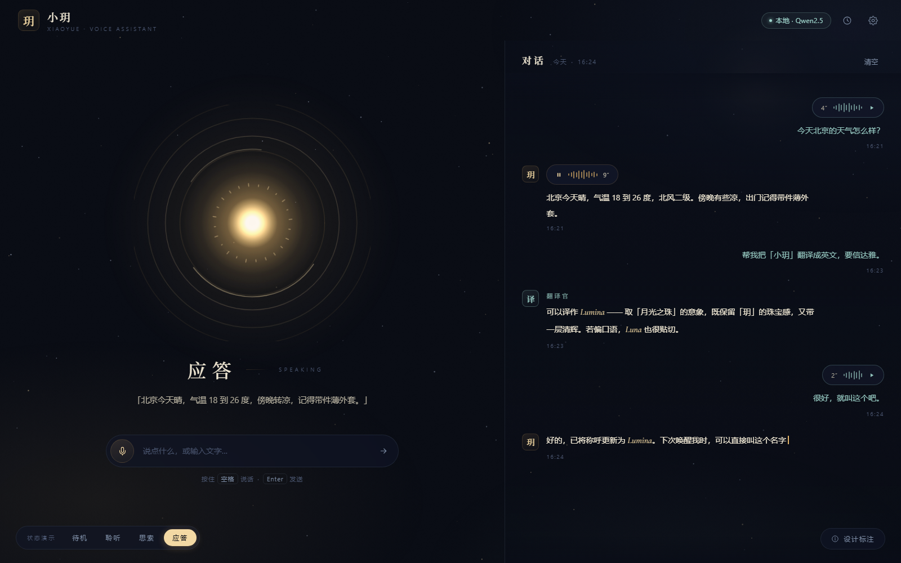

# 界面设计系统「月夜 · 明珠」

> 小玥 AI 语音助手前端重设计（v1.1.0）— 设计概念、Token 体系、组件与状态机说明。
> 实现代码见 `frontend/src/`，开发指南见 [frontend.md](frontend.md)。



---

## 1. 为什么重设计

旧界面是一个标准的 ChatGPT 风格克隆：Google Blue（#1a73e8）+ 灰底白卡 + 气泡流。
对于一个**语音优先**的助手产品，它存在四个核心问题：

| 旧设计问题 | 影响 |
|-----------|------|
| 通用配色与气泡流，无品牌人格 | 「小玥」的名字与气质在界面中不可见 |
| 语音只是输入框旁的小麦克风按钮 | 核心交互被降级为次要输入方式 |
| 音频可视化只在录音瞬间出现 | 产品最出彩的元素 95% 的时间被隐藏 |
| 状态栏堆叠圆点 + 文字提示 | 一词可表达的状态用了三种组件，信息噪音大 |

## 2. 设计概念

「玥」是传说中的明珠。新设计让助手成为一颗**有生命的光球**——语音即主角：

- **左侧舞台**：玥珠（Canvas 实时渲染的呼吸光球）居视觉中心，下方是衬线状态动词、实况字幕与胶囊输入坞。空状态不再苍白——它本身就是主视觉。
- **右侧对话流**：退居为安静的记录。取消气泡，以颜色区分声部。
- **环境层**：星野（闪烁星辰 + 远处月轮）、缓慢漂移的极光渐变、胶片颗粒，营造「月夜」氛围。



## 3. 设计 Tokens

实现位置：`frontend/src/assets/styles/main.css`

### 色彩

| Token | 值 | 用途 |
|-------|-----|------|
| `--ink-0` ~ `--ink-3` | `#090C14` → `#1B2340` | 深潭墨蓝底色阶梯（微暖，非纯黑） |
| `--gold` / `--gold-2` | `#E4B56A` / `#F3D9A4` | 月光暖金——**助手之声**，主强调色 |
| `--celadon` | `#9FD4CB` | 青瓷冷绿——**用户之声**，与暖金构成双声部 |
| `--pearl` / `--pearl-dim` | `#EFE7D3` / `#B9B3A2` | 暖白正文 |
| `--mist` / `--faint` | `#7E8EA6` / `#4C5872` | 冷灰蓝次级信息 |
| `--hair-warm` / `--hair-cool` | 金/蓝低透明度 | 发丝分割线，替代卡片堆叠 |

状态语义：模型 chip **青瓷 = 本地模型**，**暖金 = 远程模型**——颜色即状态，无需阅读文字。

### 字体

| 角色 | 字体栈 |
|------|--------|
| 展示（品牌、状态动词、印章） | `Noto Serif SC` 宋体（fallback: Songti SC / SimSun） |
| 正文（消息、输入） | 系统无衬线栈（PingFang SC / Microsoft YaHei） |
| 拉丁强调词 | `Cormorant Garamond` italic（仅限拉丁文，中文不用斜体） |

### 材质

暗色玻璃（`backdrop-filter: blur` + 低透明墨蓝底）、1px 发丝金线、柔和内发光。
禁止卡片套卡片——用留白、字重与发丝线建立层级。

## 4. 布局结构

```
┌────────────────────────────────────────────────────────┐
│  顶栏：玥印章 + 小玥字标        模型chip  历史  设置     │
├──────────────────────────────┬─────────────────────────┤
│                              │  对话                    │
│         （玥珠光球）          │  ───────────────────    │
│                              │  玥  语音pill / 消息     │
│   状态动词（待机/聆听/…）      │       右对齐=用户(青瓷)  │
│   实况字幕（识别/回复流式）     │       左对齐=小玥(暖金)  │
│                              │       印章首字=智能体     │
│   输入坞 [🎙 文本框 ➤]        │                         │
│   按住 空格 说话 · Enter 发送  │                         │
└──────────────────────────────┴─────────────────────────┘
```

响应式：`≤1024px` 时双栏变单栏，光球缩小置顶，对话流沉底。

## 5. 玥珠状态机

光球是助手之「身」，四种状态各有专属动效语言：

| 状态 | 触发条件（`useVoiceChat`） | 视觉表现 |
|------|---------------------------|----------|
| 待机 `idle` | 默认 | 缓慢呼吸（亮度/缩放 ±5%），微光涟漪 |
| 聆听 `listening` | `status === 'recording'` | 涟漪随模拟人声振幅起伏，外环泛青瓷色 |
| 思索 `thinking` | `status === 'processing'` | 16 颗粒子沿轨道加速旋转 |
| 应答 `speaking` | `isPlaying === true` | 内核 24 条声纹柱随音节包络脉冲 |

实现：`frontend/src/components/OrbCanvas.vue`（单一 Canvas，加法混合发光，参数跨状态平滑插值）。
状态动词与字幕联动：待机/聆听/思索/应答 + STANDBY/LISTENING/THINKING/SPEAKING。

## 6. 组件变更清单

| 文件 | 变更 |
|------|------|
| `components/NightSky.vue` | **新增** — 星野背景（星辰闪烁 + 月轮） |
| `components/OrbCanvas.vue` | **新增** — 玥珠光球（见上节） |
| `assets/styles/main.css` | **重写** — 新 Token 体系，单暗色主题，含 `prefers-reduced-motion` |
| `App.vue` | **重构** — 印章字标顶栏、模型 chip 双色语义、环境层挂载（逻辑不变） |
| `components/VoiceAssistant.vue` | **重构** — 双栏布局、无气泡对话流、印章头像、语音波形 pill、流式光标（全部交互逻辑保留） |
| `components/ConversationHistory.vue` | **换肤** — 暗色玻璃抽屉（逻辑零改动） |
| `components/VoiceConfig.vue` | **适配** — 暗主题可读性修复，主题切换改为单主题说明（逻辑零改动） |
| `components/AudioVisualizer.vue` | **删除** — 可视化职责已由玥珠承担 |

## 7. 动效与无障碍

- 全部动效服务于状态表达，无装饰性动效（无 hover 缩放、无滚动揭示）。
- 遵循 `prefers-reduced-motion: reduce`：动画时长降至瞬时，光球保留静态辉光。
- 中文排版不使用斜体；强调用字重、颜色或宋体/黑体变化。
- Canvas 按 `devicePixelRatio` 缩放（上限 2x），`ResizeObserver` 跟随容器尺寸。

## 8. 工程细节备忘

- **Canvas 清空竞态**：重设 `canvas.width/height` 会清空画布。`sizeOrb()` 在尺寸未变时跳过重设，变化时立即补绘一帧，避免闪烁/空白。
- **旧 Token 兼容**：`main.css` 保留了一组旧变量名 → 新色系的别名，未重写的界面（如配置弹窗深层样式）自动落入暗色。
